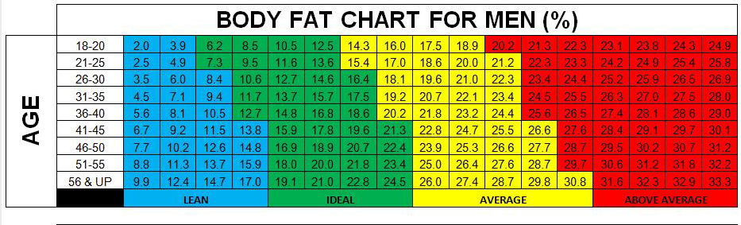

# Zed_Porfolio

## [Project 1: Bodyfat Estimation](https://github.com/zli995/Bodyfat-Estimation) 

- Performed the whole data analytics workflow, including data loading, data exploring, model selection, data visualization, and problem solving with R.
- Built a model which provides accurate estimation of men’s bodyfat with only requiring 4 input values for prediction.
- Achieved user-interface by creating a [Shiny App](https://lofia.shinyapps.io/628_hw2/) that run our bodyfat calculator in real-time.

## [Project 2: Airbnb Data Analysis](file:///C:/Users/1/Desktop/%E6%96%87%E4%BB%B6%E5%A4%B9/Fall%202019/STAT605/final%20project/Report.html)
